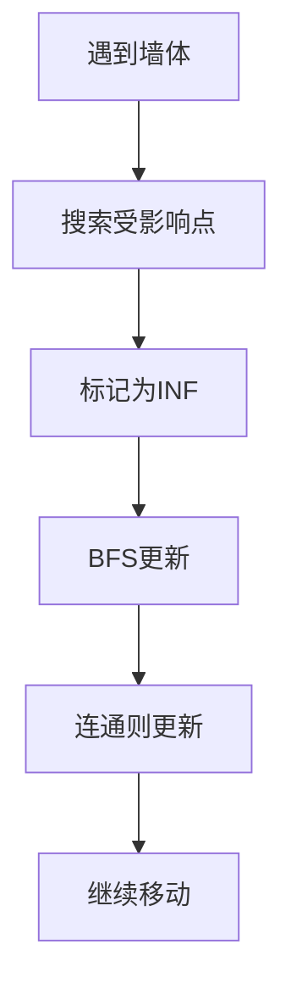

# 增量式洪水填充算法 (Incremental Flood Fill Algorithm)

> 📺 **参考视频**: [B站视频链接](https://www.bilibili.com/video/BV1Fa4y1w71q/)

---

## 🎯 背景介绍

增量式洪水填充算法是传统洪水填充算法（Flood Fill Algorithm）的**改进版本**，专门用于处理动态环境中的路径规划问题。

### 🔍 传统洪水填充算法

传统的洪水填充算法是一种用于填充连通区域的算法，在路径规划中用于计算每个点到目标的最短距离。

**❌ 主要缺点**: 当环境发生变化时（如发现新的障碍物），需要重新计算整个地图的距离场，这在大型地图或频繁变化的环境中效率很低。

### ⚡ 增量式改进

增量式洪水填充算法通过**"局部更新"**的思想解决了这个问题。当发现新的障碍物时，算法只更新那些真正受影响的区域，而不是重新计算整个地图。

**✅ 核心优势**: 大大提高了算法的效率，特别适合机器人探索、动态路径规划等应用场景。

### 🚀 应用领域

| 应用场景 | 具体用途 |
|---------|----------|
| 🤖 **机器人导航** | 实时路径规划 |
| 🎮 **游戏AI** | 动态环境中的寻路 |
| 🚗 **自动驾驶** | 障碍物检测和路径重规划 |
| 🚁 **无人机导航** | 动态避障 |

---

## 💡 核心思想

> **一句话总结**: 每次遇到墙体，将受影响的点全部搜索到，之后将这些点变成INF（极大值），然后放到队列中BFS，每个点都检查相邻点的值，如果连通就更新值，不连通的就抛出队列。

### 🔄 增量式洪水填充的核心流程



1. **🏗️ 遇到墙体** → 发现新的障碍物
2. **🔍 搜索受影响点** → 找到所有依赖旧路径的点
3. **⚠️ 标记为INF** → 将这些点设置为极大值（待更新）
4. **🔄 BFS更新** → 将这些点放入队列，检查邻居值
5. **✅ 连通则更新** → 如果找到更短路径就更新，否则跳过

---

## 📋 算法执行步骤

### 第一步：初始化距离场
首先标记每个格子到终点的距离，这一步是理想化的（假设没有障碍物）。

### 第二步：机器人移动
机器人按照距离递减的方向移动（总是朝着距离更小的方向走）。

### 第三步：发现障碍物时的处理
当遇到一堵墙（障碍物）时，只更新与这个点**相邻且数值连续递增**的所有相关点。

```
受影响点 (INF)
      ↓
查找四邻居的有效值
      ↓
如果 min + 1 < 当前值：
      → ✅ 更新 + 加入队列
否则：
      → ❌ 丢掉，不更新
```

### 第四步：继续移动
更新完成后，机器人继续按照距离递减的方向移动。

---

## 🔧 局部洪水填充算法（局部 BFS 更新逻辑）

当迷宫中的某个位置发现是墙，可能导致一部分路径失效，我们不需要重新填充整个地图，只需进行**"局部更新"**。

### 📝 步骤概述

#### 1️⃣ 找出受影响点
从新发现的墙的相邻点出发，使用 BFS 向外查找。

**🔍 查找条件**: 路径值递增的点，这些点是依赖这条旧路径的。

所有这类点都被认为是**"受影响区域"**。

#### 2️⃣ 清除旧路径值
将所有受影响的点的距离值设置为 **INF**（表示路径失效，待更新）。

#### 3️⃣ 初始化队列
将所有设为 INF 的点加入 BFS 队列，作为局部更新的起点。

#### 4️⃣ 局部 BFS 更新
对于队列中的每个点 (x, y)：

- **🔍 找到其四个邻居中 不是墙且不是 INF 的最小值**
- **📊 更新自己的值为：min(邻居值) + 1**
- **🔄 如果成功更新，就将它的邻居加入队列，继续传播**
- **⏸️ 如果邻居都无效（墙或 INF），则跳过，等待邻居先被更新**

### 🎯 关键点总结

- **🎯 只更新"依赖旧路径"的区域**，避免全图计算
- **🌊 更新逻辑为洪水填充**：最短邻居 + 1
- **📈 使用 BFS 确保更新顺序**是"由近到远"
- **🛡️ 可使用 visited/in_queue 等机制**避免重复入队

### 💻 算法伪代码

```pseudocode
function 局部洪水填充(障碍物位置):
    # 步骤1: 找出受影响点
    受影响点集合 = 空集合
    队列1 = [障碍物位置]
    
    while 队列1不为空:
        当前点 = 队列1出队()
        for 每个相邻点:
            if 相邻点数值 = 当前点数值 + 1:
                将相邻点加入受影响点集合
                将相邻点加入队列1
    
    # 步骤2: 清除旧路径值
    for 每个受影响点:
        设置距离值为 INF
    
    # 步骤3: 初始化队列
    更新队列 = 受影响点集合
    
    # 步骤4: 局部 BFS 更新
    while 更新队列不为空:
        当前点 = 更新队列出队()
        
        # 找到有效邻居的最小值
        最小值 = INF
        for 每个邻居:
            if 邻居不是墙 且 邻居不是 INF:
                最小值 = min(最小值, 邻居值)
        
        # 更新当前点
        if 最小值 != INF:
            新值 = 最小值 + 1
            if 新值 < 当前点值:
                当前点值 = 新值
                # 将邻居加入队列继续传播
                for 每个邻居:
                    if 邻居不是墙:
                        将邻居加入更新队列
```

---

## 🧠 关键理解

### ❓ 什么是"数值连续"？

在距离场中，每个点的数值表示到目标的最短距离。

**📊 数值连续**的意思是：
- 如果障碍物位置的数值是 **3**
- 那么**与它相邻且数值为 4** 的点都与它相关
- 然后继续找与这些点相邻且数值为 **5** 的点
- 以此类推，形成一条**"数值连续递增"**的路径

### 🤔 为什么只更新这些点？

| 点的数值 | 更新原因 | 处理方式 |
|---------|---------|---------|
| **1、2的点** | 最短路径不经过障碍物 | ✅ 无需更新 |
| **与障碍物相邻且数值连续递增的点** | 最短路径经过障碍物 | 🔄 需要重新计算 |

---

## 📋 算法步骤总结


1. **🔍 发现障碍物** → 记录障碍物位置
2. **🎯 找出受影响点** → 从障碍物开始BFS，找到所有数值连续递增的依赖点
3. **🗑️ 清除旧路径值** → 将所有受影响点的距离值设置为INF
4. **🚀 初始化更新队列** → 将所有INF点加入BFS队列作为起点
5. **🔄 局部BFS更新** → 从队列中的点开始，按"最短邻居+1"规则更新
6. **📈 传播更新** → 将更新后的点的邻居加入队列继续传播

---

## ⚡ 性能优势

| 方法 | 时间复杂度 | 适用场景 | 效率 |
|------|------------|----------|------|
| 🐌 传统方法 | O(地图大小) | 静态地图 | 低 |
| 🚀 增量方法 | O(相关点数量) | 动态地图 | 高 |

---

## 🎯 总结

> **发现障碍物 → 找出受影响点 → 清除旧路径值 → 局部BFS更新**

这就是增量式洪水填充的精髓：

### 🌟 核心特点

1. **🎯 通过数值连续性**判断路径依赖关系
2. **⚡ 只更新真正受影响的区域**，避免全图重新计算
3. **🔄 使用局部BFS**确保更新顺序正确
4. **🌊 采用"最短邻居+1"**的洪水填充逻辑

### 🚀 核心优势

当环境发生局部变化时，只需要更新一小部分区域，大大提高了算法的效率。

---

*📝 这种增量式方法特别适合需要实时响应的动态环境，是传统洪水填充算法的重要改进。*
